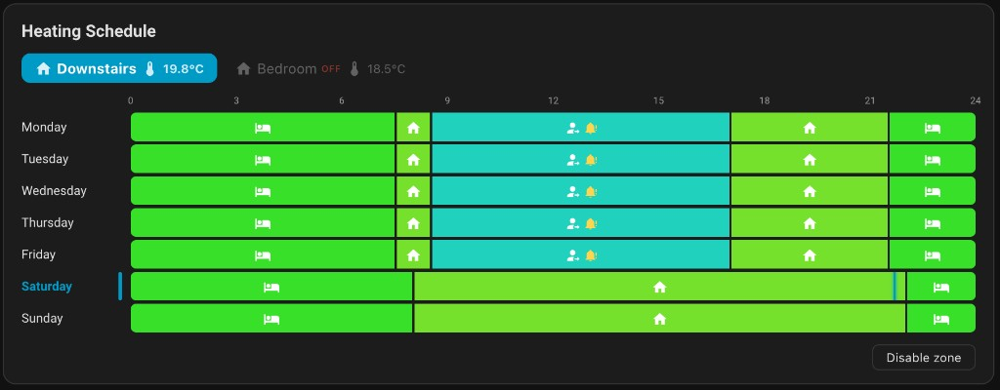
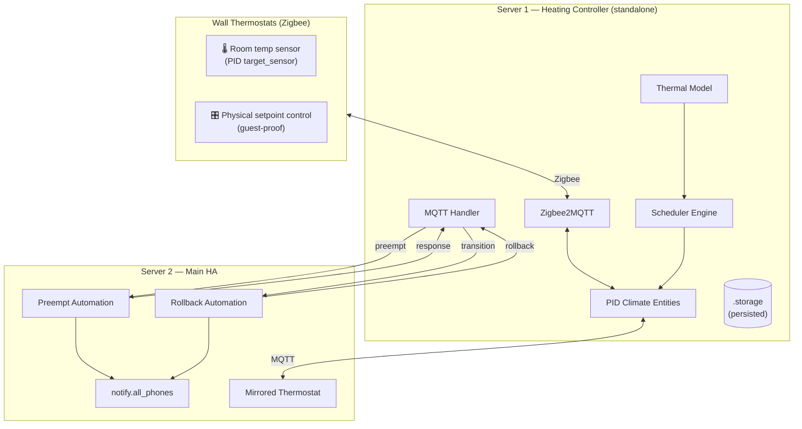
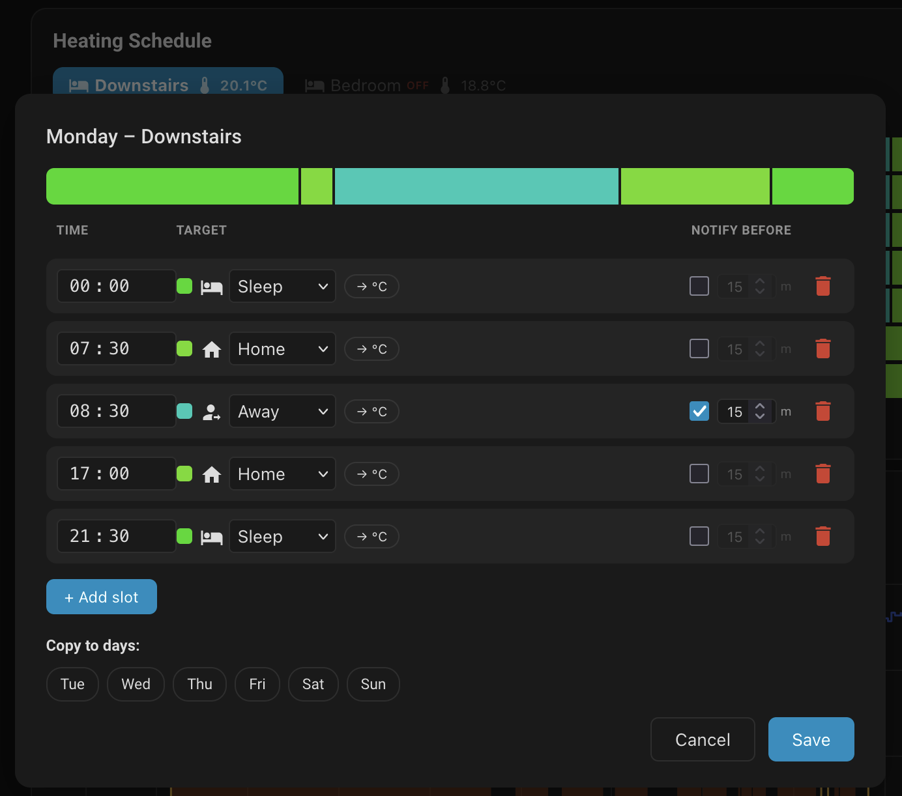

# Hestia Scheduler

A custom Home Assistant integration providing a Nest-style heating schedule with a learning thermostat, preemptive notifications, and a beautiful Lovelace card — designed for multi-zone heating systems.



[](https://github.com/hacs/integration)


---

## Overview

Hestia Scheduler was built for a real home with slow-response emitters (underfloor heating, [ThermaSkirt](https://www.discreteheat.com/thermaskirt/products-and-information/overview.aspx)) where a simple on/off thermostat would not extract all the efficiency gains. The system uses Zigbee-based wall-mounted [Bosch Room Thermostat II 230V](https://www.bosch-smarthome.com/uk/en/support/help/product-help/room-thermostat-2-230v-help/) thermostats as **both room thermometers and physical setpoint controls** — they're guest-proof, require no app, and anyone can walk up and adjust the temperature. These thermostats do not phyisically control any relays, but they feed back information to HA. On HA, a software PID controller running on each zone closes the control loop, and the scheduler orchestrates the weekly programme on top.

---
## Disclaimer

The entire repo was vibe-coded in about 8 hours with Cursor following strict instructions I've been brewing in my noggin for a while. However, I did not read or modify a single line of code. It works for me, but use with caution!

---
## Features

- **Nest-style weekly schedule card** — Visual timeline showing temperature segments across the day for each zone, with a current-time needle on today's row and a live fire icon when heating is active
- **Multi-zone support** — Manage any number of heating zones from a single integration, with zone selector tabs showing the current preset icon and live room temperature
- **Preset and temperature slots** — Each schedule slot can set a preset mode (`home`, `away`, `eco`, `sleep`, `boost`, `comfort`) or a specific temperature
- **Learning thermostat (pre-heat)** — Automatically starts heating early enough to reach the target temperature by the scheduled time, accounting for inside and outside temperature and per-zone learned heating rates.
- **Preemptive notifications** — Option to send actionable mobile notifications before configured transitions (e.g. switching to "away") so you can cancel the change if plans change. Excellent when you decide to work from home on days when simply can't get out of the bed on time...
- **Rollback notifications** — If a preemptive notification times out without a response, a follow-up notification lets you restore the previous state after the fact. This way even if you sleep through the schedule change, you can quickly restore the previous slot.
- **Restart-safe** — Detects missed transitions on startup and applies the correct schedule state
- **HA native backups** — All schedule data is stored in `.storage/hestia_scheduler.storage` and included automatically in Home Assistant backups

---

## Architecture

This integration is designed around a **standalone heating controller** that does not depend on any external system (such as internet or WiFi) to keep your home warm.

### Two-server setup

| | Server 1 (Heating Controller) | Server 2 (Main HA) |
|---|---|---|
| **Hardware** | RPi 5 (or similar) | HA Green (or similar) |
| **Role** | Runs the scheduler engine, thermal model, PID climate entities, MQTT server, and Zigbee2MQTT. | Receives MQTT events (through MQTT bridge), sends mobile notifications, relays user responses, runs dashboards and other automations |
| **Connectivity** | Operates independently — heating continues even if Server 2, Wi-Fi, or the internet goes down | Connects to Server 1 via an MQTT bridge |

**The key design principle:** Server 1 is fully autonomous. If Server 2 goes offline, the worst that happens is you don't receive phone notifications — the schedule, PID control, and pre-heating all continue running on Server 1 without interruption.



### Physical thermostats as inputs and thermometers

The Zigbee wall thermostats serve a dual purpose:

1. **Temperature sensors** — They report the room temperature back to the PID controller as the `target_sensor`, providing accurate, per-room readings without any additional hardware.
2. **Guest-proof physical controls** — Anyone can walk up to a thermostat and adjust the temperature without needing the HA app, a phone, or any technical knowledge. Changes made on the physical thermostat sync through to Server 1, and if Server 2 is connected, reflect there too.

This means the heating system is fully operable even for guests, children, or anyone unfamiliar with smart home technology — they just use the thermostat on the wall which will sync back to Server 1 and Server 2 equally.

### PID controller

Each zone runs a software PID (Proportional-Integral-Derivative) controller via the [HASmartThermostat](https://github.com/ScratMan/HASmartThermostat) integration. This provides accurate closed-loop temperature control far superior to simple on/off hysteresis, especially important for slow-response emitters like underfloor heating.

The PID controller:
- Takes the wall thermostat's temperature reading as input (`target_sensor`)
- Computes a PWM duty cycle based on the error between current and target temperature
- Supports tunable `Kp`, `Ki`, `Kd` gains, configurable PWM period, and outdoor temperature compensation (`Ke`)
- Exposes preset modes (`home`, `away`, `eco`, `sleep`, `boost`, `comfort`) with per-preset target temperatures

The Hestia Scheduler sits **on top of** the PID controller — it sets the preset or target temperature according to the weekly schedule, and the PID controller handles the actual closed-loop heating control.

Example PID configuration for a zone:

```yaml
climate:
  - platform: smart_thermostat
    name: PID Downstairs
    unique_id: pid_downstairs
    heater: switch.downstairs_heat_call
    target_sensor: sensor.downstairs_thermostat_temperature
    outdoor_sensor: sensor.outdoor_temperature
    min_temp: 5
    max_temp: 30
    target_temp: 20
    keep_alive:
      seconds: 30
    kp: 50
    ki: 0.01
    kd: 6000
    ke: 0.6
    pwm: 00:30:00
    sampling_period: 00:05:00
    away_temp: 12
    eco_temp: 9
    boost_temp: 25
    sleep_temp: 18
    home_temp: 20
    comfort_temp: 22
```

See the [HASmartThermostat documentation](https://github.com/ScratMan/HASmartThermostat) for full parameter reference and PID tuning guidance.

---

## The Lovelace Card

The card provides a visual weekly overview of your heating schedule, inspired by the Nest thermostat's timeline view.


### Reading the card

- **Zone tabs** — At the top, tabs show each configured zone. The active tab is highlighted. Each tab displays:
  - The **preset icon** for the currently active schedule slot (e.g. a house icon for "home")
  - A **thermometer icon** with the **live room temperature** reading from the zone's thermostat
  - A red **OFF** badge if the zone's schedule is disabled
- **Day rows** — Each row represents one day of the week (Monday–Sunday). Today's row is highlighted with the day name in the accent colour and a **vertical blue marker** at the left edge.
- **Time axis** — Hour markers (0–24) run along the top, aligned with the coloured bars below.
- **Coloured segments** — Each segment represents a schedule slot. The colour is derived from the **target temperature** on a gradient scale:
  - **Cool blues/teals** (≈9–15°C) — eco/away temperatures
  - **Greens** (≈18–21°C) — home/sleep temperatures
  - **Warm yellows/oranges** (≈22–25°C) — comfort/boost temperatures
  - **Reds** (≈26°C+) — very high targets
- **Preset icons** — Inside each segment, a small icon identifies the preset:
  - 🏠 `mdi:home` — Home
  - 👤→ `mdi:account-arrow-right` — Away
  - 🍃 `mdi:leaf` — Eco
  - 🛏️ `mdi:bed` — Sleep
  - 🚀 `mdi:rocket-launch` — Boost
  - ☀️ `mdi:white-balance-sunny` — Comfort
  - For direct temperature slots, the numeric value (e.g. `20.0°C`) is shown instead
- **Bell icon** (🔔 `mdi:bell-alert`, gold) — Appears next to the preset icon on **preemptable** slots. This means the scheduler will send a notification to your phone *before* this transition fires, giving you the chance to cancel it. See [Preemptive Action](#preemptive-action-bell-icon) below.
- **Current-time needle** — A vertical blue line on today's row shows the current time, updating every minute.
- **Fire icon** (🔥 `mdi:fire`, red) — Appears on the current-time needle when the zone's climate entity reports `hvac_action: heating`, so you can see at a glance whether the heating is actively firing.
- **Pre-heat gradient** — When the learning thermostat decides to start heating early, a **gradient overlay** appears on today's row blending from the current slot's colour into the next slot's colour. This visually shows the pre-heat window. A brighter/more opaque gradient means pre-heating is actively happening right now; a fainter gradient indicates a remembered/predicted pre-heat window from the thermal model.
- **Hover cursor** — Moving the mouse over the weekly grid shows a vertical cursor with a time label, making it easy to read exact times.

### Editing a schedule

Click on any day row to open the **day editor popup**:



The editor shows:
- **Timeline preview** — A miniature coloured bar at the top reflecting your current edits in real time.
- **Slot list** — Each slot has:
  - **Time** — An `HH:MM` time picker for when this slot activates
  - **Target** — Either a **preset dropdown** (Home, Away, Eco, Sleep, Boost, Comfort) with its icon and colour swatch, or a **direct temperature** input. Click the `→ °C` / `→ Preset` toggle button to switch between modes.
  - **Notify before** — A checkbox and minutes input for preemptive notifications. Check the box and set the lead time (e.g. 15 minutes) to receive an MQTT message before this transition fires. This is typically used on "away" slots so you can cancel the setback if you're unexpectedly still home.
  - **Delete** — A red trash icon to remove the slot.
- **+ Add slot** — Adds a new slot at the bottom, defaulting to 1 hour after the last slot.
- **Copy to days** — Select other days of the week to copy this schedule to when you save. Useful for setting up a consistent weekday schedule.
- **Save / Cancel** — Save commits the schedule via the WebSocket API and immediately reloads the scheduler engine. Cancel discards changes.

### Card configuration

```yaml
type: custom:hestia-schedule-card
```

Optional parameters:

```yaml
type: custom:hestia-schedule-card
default_zone: downstairs       # which zone tab is selected on load
show_current_temp: true        # show thermometer + temperature in tabs (default: true)
zone_id: downstairs            # restrict card to a single zone (omit for all zones with tabs)
```

---

## Preemptive Action (Bell Icon)

The bell icon (`mdi:bell-alert`) on the schedule card marks a **preemptable transition** — a slot where you want advance warning before the scheduler changes the heating.

The most common use case: you have an "away" slot at 08:30 on weekdays. On most days you leave for work and the house should setback. But sometimes you work from home, and you don't want the house to go cold. The preemptive notification gives you a chance to cancel.

### How it works

1. **Lead time** — The notification is sent `preempt_lead_minutes` (default: 15) before the scheduled transition time. This is configurable per slot in the day editor.
2. **Phone notification** — Server 2 receives the preemption event via MQTT and sends an actionable notification to all configured phones:
   > *"Downstairs schedule change: Switching to 'away' at 9:00. Cancel or it proceeds automatically."*
   >
   > **[Cancel]**
3. **User response** —
   - **Tap "Cancel"**: The transition is skipped, the current preset remains active until the next slot.
   - **Dismiss / Ignore**: The transition proceeds as scheduled when the time arrives.
4. **Rollback** — If the notification was ignored (timed out with no response) and the transition proceeded, a **follow-up notification** is sent:
   > *"Downstairs schedule change: switched from 'home' to 'away'. Tap below to revert."*
   >
   > **[Restore]**

   This rollback option remains available until the next scheduled transition (or 6 hours, whichever comes first). This covers the "I was in the shower and missed the notification" scenario.
5. **Missed transitions** — If Server 1 restarts and a preemptable transition was missed during downtime, the slot is applied but a rollback notification is published so you can still revert.

---

## Learning Thermostat (Pre-Heat)

Slow emitters like underfloor heating can take 30–120+ minutes to bring a room up to temperature. The learning thermostat estimates how early to start heating so the room reaches the target by the scheduled time.

### How it works

```
adjusted_rate = base_rate × max(0.3, 1 − loss_factor × (ref_outside − outside_temp))
lead_minutes  = (target_temp − current_temp) / adjusted_rate × 60
```

- **`base_rate`** — The heat-up rate for this zone in °C/hour. The code default is **0.5** (set during zone setup). This is a reasonable starting point for underfloor heating; for faster-response emitters like radiators, set it to **1.0** in the zone setup wizard. The system learns the true value over time regardless — the initial setting only determines how quickly it converges.
- **`loss_factor`** — How much colder outside air reduces the effective heat-up rate (default: 0.03 per °C below reference).
- **`ref_outside_temp`** — The reference outside temperature at which the base rate was calibrated (default: 10°C).

After each heat-up cycle, the model updates `base_rate` and `loss_factor` via an exponential moving average (α = 0.15), gradually improving its predictions. All parameters are persisted in `.storage/hestia_scheduler.storage` and included in HA native backups.

The pre-heat lead time is re-evaluated whenever the room or outside temperature changes (via HA state change events), so the system adapts in real time if conditions shift (e.g. a sudden cold snap or opening a window).

### Pre-heat on the card

When pre-heating is active or predicted, the card shows a **gradient overlay** on today's row, blending from the current segment colour into the upcoming segment's colour. This gives a visual indication of when the heating will start ramping up.

---

## Cross-Instance Integration

### Location sharing (Server 2 → Server 1)

GPS / occupancy state from phones connected to Server 2 can be shared to Server 1 via MQTT. This allows automations on Server 1 to react to whether anyone is home, though in practice a fixed schedule with preemptive notifications was found to be more reliable than GPS-based away detection (short trips to the shops would wrongly trigger cold setbacks before the occupants returned).

### Morning alarm clocks

Morning alarm data from Server 2 (or directly from phone APIs) could easily feed into the scheduler via MQTT or service calls to adjust the pre-heat start time. For example, if your alarm is set for 06:30 instead of the usual 07:30, the scheduler could start pre-heating an hour earlier so the house is warm when you wake up. The MQTT bridge and service infrastructure are already in place — this only requires a lightweight automation on Server 2.

---

## Installation

### Via HACS (recommended)

1. In HACS, go to **Integrations** → menu (top right) → **Custom repositories**
2. Add `https://github.com/davidanderle/hestia-scheduler` with category **Integration**
3. Install **Hestia Scheduler** and restart Home Assistant
4. Go to **Settings → Integrations → Add Integration** and search for **Hestia Scheduler**

### Manual

Copy `custom_components/hestia_scheduler/` into your HA config `custom_components/` directory and restart.

---

## Configuration

### Initial setup

1. Go to **Settings → Integrations → Add Integration → Hestia Scheduler**
2. Configure your first zone:
   - **Zone ID**: short identifier, e.g. `downstairs`
   - **Zone name**: display name, e.g. `Downstairs`
   - **Climate entity**: the PID climate entity to control (e.g. `climate.pid_downstairs`)
   - **Outside temperature sensor** (optional): improves learning thermostat accuracy
   - **Base heat rate** (°C/hr): starting value for the thermal model. Use `0.5` for underfloor heating, `1.0` for thermaskirt or radiators. The system will learn the real value from observed heat-up events, so this is just a warm-start hint.

### Adding more zones

Go to **Settings → Integrations → Hestia Scheduler → Configure** and choose **Add zone**.

### Lovelace card setup

The card resource is registered automatically by the integration. If needed, manually add `/hestia_scheduler/hestia-schedule-card.js` as a module in **Lovelace resources**.

---

## MQTT Setup (Server 2 Bridge)

Add these lines to the Mosquitto bridge configuration on Server 2 (e.g. `/share/mosquitto/bridge.conf`):

```
# Hestia Scheduler: preemption + rollback
topic hestia/scheduler/+/preempt in 0
topic hestia/scheduler/+/preempt/response out 0
topic hestia/scheduler/+/transition in 0
topic hestia/scheduler/+/rollback out 0
topic hestia/scheduler/state in 0
```

Restart Mosquitto after editing.

### MQTT topics reference

| Topic | Direction | Purpose |
|-------|-----------|---------|
| `hestia/scheduler/{zone}/preempt` | Server 1 → Server 2 | Pre-transition notification payload |
| `hestia/scheduler/{zone}/preempt/response` | Server 2 → Server 1 | User response: `{"action": "skip"}` or `{"action": "proceed"}` |
| `hestia/scheduler/{zone}/transition` | Server 1 → Server 2 | Post-transition event (includes rollback context) |
| `hestia/scheduler/{zone}/rollback` | Server 2 → Server 1 | Rollback command: `{"action": "restore_previous"}` |
| `hestia/scheduler/state` | Server 1 → Server 2 | Full retained schedule state |

---

## Server 2 Automations

### Preemption notification

```yaml
alias: "Hestia Schedule: Preemption Notification"
description: ""
triggers:
  - trigger: mqtt
    options:
      topic: hestia/scheduler/+/preempt
actions:
  - variables:
      data: "{{ trigger.payload | from_json }}"
      zone: "{{ data.zone }}"
      current_preset: "{{ data.current_preset | default('unknown') }}"
      next_preset: "{{ data.next_preset | default(none) }}"
      next_temp: "{{ data.next_temp | default(none) }}"
      scheduled_time: "{{ data.scheduled_time }}"
      deadline: "{{ data.deadline_seconds | int(60) }}"
      action_skip: HESTIA_PREEMPT_SKIP_{{ context.id }}
      action_proceed: HESTIA_PREEMPT_PROCEED_{{ context.id }}
      target_label: >-
        {{ next_preset }}{{ next_temp }}°C
  - action: notify.all_phones
    data:
      title: 🌡️ {{ zone | title }} schedule change
      message: >-
        Switching to '{{ target_label }}' at {{ scheduled_time }}. Cancel or it
        proceeds automatically.
      data:
        tag: hestia_preempt_{{ zone }}
        ttl: 0
        priority: high
        actions:
          - action: "{{ action_skip }}"
            title: Cancel
  - wait_for_trigger:
      - trigger: event
        event_type: mobile_app_notification_action
        event_data:
          action: "{{ action_skip }}"
      - trigger: event
        event_type: mobile_app_notification_cleared
        event_data:
          tag: hestia_preempt_{{ zone }}
    timeout:
      seconds: "{{ deadline | int }}"
    continue_on_timeout: true
  - if:
      - condition: template
        value_template: "{{ wait.trigger is defined and wait.trigger is not none }}"
    then:
      - variables:
          response: >-
            skipproceed
      - action: mqtt.publish
        data:
          topic: hestia/scheduler/{{ zone }}/preempt/response
          payload: "{\"action\": \"{{ response }}\"}"
mode: parallel
max: 4
```

### Rollback notification

```yaml
alias: "Hestia Schedule: Rollback Notification"
description: ""
triggers:
  - trigger: mqtt
    options:
      topic: hestia/scheduler/+/transition
conditions:
  - condition: template
    value_template: >-
       {{ d.rollback_available |
      default(false) and not d.user_responded | default(true) }}
actions:
  - variables:
      data: "{{ trigger.payload | from_json }}"
      zone: "{{ data.zone }}"
      new_preset: "{{ data.new_preset | default('unknown') }}"
      prev_preset: "{{ data.previous_preset | default('unknown') }}"
      action_restore: HESTIA_ROLLBACK_{{ context.id }}
  - action: notify.all_phones
    data:
      title: 🌡️ {{ zone | title }} schedule change
      message: >-
        Switched from '{{ prev_preset }}' to '{{ new_preset }}'. Tap restore to
        undo.
      data:
        tag: hestia_rollback_{{ zone }}
        ttl: 0
        priority: high
        actions:
          - action: "{{ action_restore }}"
            title: Restore
  - wait_for_trigger:
      - trigger: event
        event_type: mobile_app_notification_action
        event_data:
          action: "{{ action_restore }}"
    timeout: "02:00:00"
    continue_on_timeout: true
  - if:
      - condition: template
        value_template: "{{ wait.trigger is defined and wait.trigger is not none }}"
    then:
      - action: mqtt.publish
        data:
          topic: hestia/scheduler/{{ zone }}/rollback
          payload: "{\"action\": \"restore_previous\"}"
      - action: notify.all_phones
        data:
          message: "{{ zone | title }} schedule restored to {{ prev_preset }}."
          data:
            tag: hestia_rollback_{{ zone }}
mode: parallel
max: 4
```

---

## Schedule Data Model

Each zone has a weekly schedule. Each day is a list of time slots. A slot holds its setpoint **until the next slot** (the last slot of a day carries over to the next day's first slot):

```yaml
- time: "07:30"
  preset: "home"          # OR use temperature (not both)
  temperature: null
  preemptable: false
  preempt_lead_minutes: 15

- time: "08:30"
  preset: "away"
  temperature: null
  preemptable: true       # triggers preemptive notification
  preempt_lead_minutes: 15
```

**Available presets:** `home`, `away`, `eco`, `sleep`, `boost`, `comfort`

---

## Sensor Entities

The integration creates two sensor entities per zone, visible under **Settings → Integrations → Hestia Scheduler**:

### Schedule sensor (`sensor.hestia_<zone>_schedule`)

| Attribute | Description |
|-----------|-------------|
| State | Current active preset or temperature |
| `next_preset` / `next_temperature` | Upcoming slot target |
| `next_time` / `next_transition` | When the next slot fires |
| `preheating` | `true` while pre-heating is active |
| `enabled` | Whether the zone schedule is active |

### Pre-heat sensor (`sensor.hestia_<zone>_pre_heat`)

| Attribute | Description |
|-----------|-------------|
| State | `preheating`, `scheduled`, or `idle` |
| `current_room_temp` | Current room temperature |
| `outside_temp` | Current outside temperature |
| `base_heat_rate_c_hr` | Learned base heat rate (°C/hr) |
| `adjusted_heat_rate_c_hr` | Heat rate adjusted for current outside temp |
| `lead_minutes` | Estimated pre-heat lead time |
| `preheat_start_local` | When pre-heating will start (or did start) |
| `resolved_target_temp` | Target temperature for the next slot |
| `temp_delta` | Difference between target and current temp |
| `preset_temp_cache` | Learned preset → temperature mappings |

---

## Services

| Service | Description |
|---------|-------------|
| `hestia_scheduler.set_zone_schedule` | Replace the schedule for a specific day in a zone |
| `hestia_scheduler.enable_zone` | Enable scheduling for a zone |
| `hestia_scheduler.disable_zone` | Disable scheduling (heating continues but is not auto-controlled) |
| `hestia_scheduler.skip_next_transition` | Skip the next scheduled transition (one-off manual override) |

---

## License

MIT
